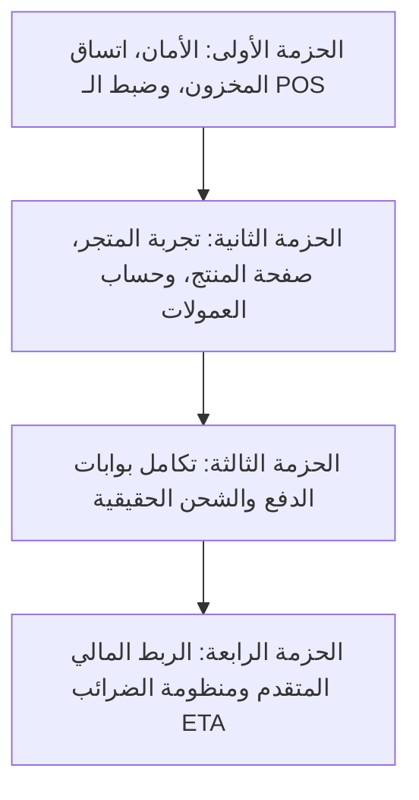

# التقرير الشامل لنظام "أبطال الرياضة الإسكندرية" (Sports Champions ERP & Storefront)
### الفحص الفني المعماري، الوظائف الحالية، خريطة الفجوات، وخطة المهام المقترحة
**تاريخ الفحص:** سبتمبر 2026  
**إصدار النظام:** 1.0.0  
**البيئة التقنية:** Next.js 15 (App Router), React 19, TypeScript, Prisma ORM 6.3, PostgreSQL (Neon DB), NextAuth v4, Zustand 5, Tailwind CSS v4, Cloudinary SDK, next-intl.

---

## فهرس التقرير
1. [الملخص التنفيذي والمفهوم المعماري للنظام](#1-الملخص-التنفيذي-والمفهوم-المعماري-للنظام)
2. [دليل الوظائف والأنظمة الفرعية الحالية (ما يفعله النظام بالفعل)](#2-دليل-الوظائف-والأنظمة-الفرعية-الحالية-ما-يفعله-النظام-بالفعل)
   - [2.1 المتجر الإلكتروني للعملاء (B2C Storefront)](#21-المتجر-الإلكتروني-للعملاء-b2c-storefront)
   - [2.2 نقطة البيع السحابية للمعارض (POS Terminal)](#22-نقطة-البيع-السحابية-للمعارض-pos-terminal)
   - [2.3 إدارة الطلبات والمبيعات (Unified Orders & Sales)](#23-إدارة-الطلبات-والمبيعات-unified-orders--sales)
   - [2.4 إدارة الكتالوج والأصناف والوسائط (Products & Media)](#24-إدارة-الكتالوج-والأصناف-والوسائط-products--media)
   - [2.5 إدارة المخزون متعدد الفروع والتحويلات (Multi-Branch Inventory & Transfers)](#25-إدارة-المخزون-متعدد-الفروع-والتحويلات-multi-branch-inventory--transfers)
   - [2.6 المشتريات والموردين (Purchasing & Suppliers)](#26-المشتريات-والموردين-purchasing--suppliers)
   - [2.7 العملاء وبرنامج الولاء (CRM & Loyalty)](#27-العملاء-وبرنامج-الولاء-crm--loyalty)
   - [2.8 الموارد البشرية والمرتبات والعمولات (HR & Payroll)](#28-الموارد-البشرية-والمرتبات-والعمولات-hr--payroll)
   - [2.9 الحسابات، الأرباح، المصروفات، وضرائب ETA](#29-الحسابات-الأرباح-المصروفات-وضرائب-eta)
   - [2.10 التقارير والتحليلات وتقييم المخزون (Reports & Analytics)](#210-التقارير-والتحليلات-وتقييم-المخزون-reports--analytics)
   - [2.11 الإشعارات، المستخدمين، والصلاحيات (Admin, Roles & Notifications)](#211-الإشعارات-المستخدمين-والصلاحيات-admin-roles--notifications)
3. [خريطة الفجوات التقنية وما يحتاج إلى ربط أو تصحيح (The Gaps & Missing Links)](#3-خريطة-الفجوات-التقنية-وما-يحتاج-إلى-ربط-أو-تصحيح-the-gaps--missing-links)
   - [الفجوة الأولى: حماية نقطة البيع POS والربط الديناميكي بالفروع والكاشير](#الفجوة-الأولى-حماية-نقطة-البيع-pos-والربط-الديناميكي-بالفروع-والكاشير)
   - [الفجوة الثانية: مسار بوابات الدفع الإلكتروني (Paymob / Fawry / Webhooks)](#الفجوة-الثانية-مسار-بوابات-الدفع-الإلكتروني-paymob--fawry--webhooks)
   - [الفجوة الثالثة: إيصالات التحويل البنكي (InstaPay / Vodafone Cash)](#الفجوة-الثالثة-إيصالات-التحويل-البنكي-instapay--vodafone-cash)
   - [الفجوة الرابعة: دورة حياة المخزون عند الإلغاء والمرتجع (Missing Inventory Restock)](#الفجوة-الرابعة-دورة-حياة-المخزون-عند-الإلغاء-والمرتجع-missing-inventory-restock)
   - [الفجوة الخامسة: غياب العمليات الذرية المتزامنة (Prisma Interactive Transactions)](#الفجوة-الخامسة-غياب-العمليات-الذرية-المتزامنة-prisma-interactive-transactions)
   - [الفجوة السادسة: شركات الشحن وإشعارات التوصيل (Couriers & Webhooks)](#الفجوة-السادسة-شركات-الشحن-وإشعارات-التوصيل-couriers--webhooks)
   - [الفجوة السابعة: تهيئة المنتجات متعددة الفروع وغياب صفحة تفاصيل المنتج](#الفجوة-السابعة-تهيئة-المنتجات-متعددة-الفروع-وغياب-صفحة-تفاصيل-المنتج)
   - [الفجوة الثامنة: الأمان وصلاحيات الأدوار على مستوى السيرفر (RBAC Guarding)](#الفجوة-الثامنة-الأمان-وصلاحيات-الأدوار-على-مستوى-السيرفر-rbac-guarding)
   - [الفجوة التاسعة: حساب عمولات الموظفين بناءً على المبيعات الفعلية](#الفجوة-التاسعة-حساب-عمولات-الموظفين-بناءً-على-المبيعات-الفعلية)
   - [الفجوة العاشرة: الربط الحقيقي مع منظومة الفاتورة الإلكترونية لمصلحة الضرائب (ETA)](#الفجوة-العاشرة-الربط-الحقيقي-مع-منظومة-الفاتورة-الإلكترونية-لمصلحة-الضرائب-eta)
4. [مصفوفة الأولويات وخطة حزم المهام المقترحة (Actionable Task Packages)](#4-مصفوفة-الأولويات-وخطة-حزم-المهام-المقترحة-actionable-task-packages)

---

## 1. الملخص التنفيذي والمفهوم المعماري للنظام

نظام **"أبطال الرياضة الإسكندرية" (Sports Champions ERP & E-Commerce)** مصمم كمنصة موحدة ومترابطة تخدم محلات بيع الملابس والمعدات الرياضية في الإسكندرية (المقر الرئيسي: فرع الإبراهيمية، والفرع الثاني: سموحة).

### المحاور الثلاثة التي يرتكز عليها النظام:
1. **واجهة المتجر الإلكتروني (Omnichannel Storefront):** تسمح للعملاء بتصفح المعدات حسب الرياضة، معرفة الرصيد الفعلي المتاح بالفرع، الطلب أونلاين أو عبر الواتساب، واختيار التوصيل للمنازل أو الاستلام المجاني من الفرع.
2. **شاشة نقطة البيع السحابية (POS Terminal):** واجهة سريعة لموظف الكاشير بالمعرض تدعم أجهزة الباركود، حساب ضريبة الـ 14% تلقائياً، توليد إيصال ضريبي فوري مع QR Code متوافق مع معايير مصلحة الضرائب المصرية، ونظام حفظ المبيعات عند انقطاع الإنترنت (Offline Sale Queue).
3. **نظام إدارة موارد المؤسسة (Comprehensive ERP Back-office):** يشمل إدارة المخزون متعدد الفروع، المشتريات وأوامر التوريد، المرتبات والعمولات، الحسابات الختامية والأرباح، المصروفات التشغيلية، سجلات الموردين والعملاء، وسجل تدقيق كامل لكل حركة مخزنية (Inventory Audit Logs).

---

## 2. دليل الوظائف والأنظمة الفرعية الحالية (ما يفعله النظام بالفعل)

### 2.1 المتجر الإلكتروني للعملاء (B2C Storefront)
* المسار: `src/app/[locale]/(storefront)/`
* اللغات: ثنائي اللغة (العربية `ar` افتراضياً، والإنجليزية `en`) مع دعم كامل لاتجاه النصوص (RTL/LTR).
* **الصفحة الرئيسية (`/`):**
  - شريط إعلانات علوي يعرض عنوان فرع الإبراهيمية الرئيسي ورقم الهاتف الأرضي `03 5926908` ورابط واتساب مباشر.
  - بنر رئيسي (Hero Banner) مع أزرار انتقال سريعة.
  - تصنيفات رياضية تفاعلية: معدات الكارديو، مستلزمات السباحة، أدوات الجيم، الملابس والأحذية، الواقيات والأحزمة العلاجية.
  - استعراض المنتجات المميزة مع مؤشر فوري لتوافر المنتج في المعرض (`متوفر بفرع الإبراهيمية (X قطعة)`).
  - زر طلب مباشر وسريع عبر الواتساب لكل منتج يولد رسالة جاهزة تتضمن اسم المنتج والكود (SKU) والسعر.
  - زر واتساب عائم أسفل الشاشة للتواصل الدائم.
* **صفحة الكتالوج والمنتجات (`/catalog`):**
  - فلترة وتصفية حسب القسم الرياضي (Category Slug).
  - محرك بحث نصي يبحث في الاسم العربي، الإنجليزي، والكود (SKU).
* **صفحة الفروع (`/branches`):**
  - استعراض فروع الإسكندرية (فرع الإبراهيمية الرئيسي 92 شارع عمر لطفي، وفرع سموحة أمام نادي سموحة).
  - عرض ساعات العمل، أرقام الهواتف المباشرة، روابط واتساب، وإحداثيات خرائط جوجل لكل فرع.
* **سلة المشتريات (`/cart`):**
  - متصلة بـ Zustand Store (`cartStore`) ومحفوظة في المتصفح (Local Storage).
  - احتساب المجموع الفرعي، ضريبة القيمة المضافة 14% تلقائياً.
  - اختيار منطقة التوصيل بالإسكندرية والمحافظات لحساب مصاريف الشحن التلقائية.
* **صفحة إتمام الطلب (`/checkout`):**
  - خيار نوع الاستلام: استلام مجاني من فرع الإبراهيمية أو توصيل للمنزل.
  - طرق الدفع: الدفع عند الاستلام (COD)، باي مب (Paymob)، فوري (Fawry)، إنستاباي ومحفظة فودافون كاش.
  - التحقق من البيانات وإنشاء رقم طلب تسلسلي `ORD-2026-XXXX`.
* **صفحة تتبع الطلبات (`/tracking`):**
  - إمكانية تتبع مسار الشحنة وحالة الطلب عبر إدخال: رقم الطلب، رقم هاتف العميل، أو رقم بوليصة الشحن (Tracking Number).

---

### 2.2 نقطة البيع السحابية للمعارض (POS Terminal)
* المسار: `src/app/[locale]/pos/page.tsx`
* **إدارة التذاكر والمبيعات:**
  - عرض أصناف المنتجات مع أسعارها وصورها والمخزون الحالي لكل صنف.
  - إضافة المنتجات للتذكرة بالنقرة أو مسح الباركود، ومنع إضافة أي صنف نافد من المخزون.
  - زيادة/إنقاص الكميات، وحذف الأصناف.
  - حساب المجموع الفرعي، الخصم، ضريبة القيمة المضافة المصرية 14% بدقة، والإجمالي الصافي.
* **نظام الخصومات والرقابة الإدارية:**
  - طلب رقم PIN سري للمدير عند الرغبة في تطبيق خصم يتجاوز 100 جنيه.
* **ملف العميل وبرنامج الولاء:**
  - بحث سريع برقم هاتف العميل واسترجاع رصيد نقاط الولاء السابقة.
  - إمكانية تسجيل عميل جديد فوراً من شاشة الكاشير دون مغادرة الفاتورة (Quick Add Customer).
  - احتساب وإضافة نقاط ولاء جديدة للعميل (نقطة لكل 10 جنيهات يتم صرفها).
* **طرق السداد وحساب المتبقي (Change Calculator):**
  - دعم الدفع نقداً (CASH)، بطاقة فيزا/ماستركارد (CARD)، أو تحويل فوري (INSTAPAY).
  - حاسبة المبلغ المدفوع والمتبقي للعميل (Tendered & Change).
* **الإيصال والطباعة الحرارية:**
  - نافذة منبثقة تفاعلية للإيصال (Receipt Modal) مجهزة للطباعة المباشرة على الطابعات الحرارية (Thermal POS Printers).
  - توليد رمز QR مشفر يحتوي على معايير منظومة الإيصال الإلكتروني لمصلحة الضرائب المصرية (ETA).
* **دعم العمل دون اتصال بالإنترنت (Offline Mode & Sync):**
  - في حال انقطاع الإنترنت أو تعثر السيرفر، يتم تخزين الفواتير في طابور محلي (`offlineQueue`).
  - ظهور زر "مزامنة الفواتير غير المكتملة" لمزامنتها مع قاعدة البيانات فور عودة الاتصال.

---

### 2.3 إدارة الطلبات والمبيعات (Unified Orders & Sales)
* المسار: `src/app/[locale]/admin/orders` و `/api/admin/orders`
* **عرض موحد للمبيعات:** يجمع جدول الطلبات بين:
  - طلبات المتجر الإلكتروني (`Order` - المصدر ONLINE).
  - مبيعات الكاشير بالمعارض (`Sale` - المصدر POS).
* **الفلترة والفرز:**
  - فلترة حسب الحالة: `PENDING`, `CONFIRMED`, `PROCESSING`, `SHIPPED`, `DELIVERED`, `CANCELLED`, `RETURNED`.
  - فلترة حسب مصدر الطلب: `ONLINE`, `POS`, `WHATSAPP`.
* **تفاصيل الطلب المنبثقة:** استعراض تفاصيل المنتجات، الكميات، الأسعار، عنوان العميل، بوليصة الشحن، وطريقة الدفع.
* **تعديل حالات الطلب والدفع:** إمكانية تحديث حالة الشحنة وحالة السداد مباشرة من الجدول.
* **إنشاء طلب يدوي:** إمكانية قيام موظف الإدارة بإنشاء طلب هاتفي/واتساب يدوي واختيار العميل والفرع والمنتجات.

---

### 2.4 إدارة الكتالوج والأصناف والوسائط (Products & Media)
* المسار: `src/app/[locale]/admin/products` و `/api/admin/products`
* **إدارة المنتجات (Full CRUD):**
  - إضافة وتعديل وحذف المنتجات الرياضية.
  - الحقول المدعومة: كود الصنف (SKU)، الباركود (Barcode)، الاسم بالعربية والإنجليزية، الوصف بالعربية والإنجليزية، سعر البيع، سعر التكلفة (Cost Price)، المقاس، اللون، القسم، والماركة.
  - تمييز المنتجات كمميزة (Featured) للظهور في الصفحة الرئيسية.
  - فحص مسبق لمنع حذف أي منتج له مبيعات أو طلبات سابقة حفاظاً على سلامة السجلات المالية.
* **إدارة الأقسام والماركات (Categories & Brands):**
  - تبويبات مخصصة لإنشاء وتعديل الأقسام والماركات داخل نفس الصفحة.
* **رفع الصور والوسائط عبر السحابة (Cloudinary Integration):**
  - مسار API مخصص (`/api/admin/upload`) يرفع الصور مباشرة إلى Cloudinary في مجلد `sports-champions/products`.
  - دعم رفع الملفات من الجهاز (Drag & Drop) أو إدخال روابط الصور المباشرة.

---

### 2.5 إدارة المخزون متعدد الفروع والتحويلات (Multi-Branch Inventory & Transfers)
* المسار: `src/app/[locale]/admin/inventory` و `/api/admin/transfers`
* **مراقبة المخزون لكل فرع على حدة:**
  - استعراض أرصدة المنتجات في فرع الإبراهيمية وفرع سموحة بشكل مستقل تماماً عبر جدول `BranchInventory`.
  - تنبيهات النواقص (Low Stock Warning) عند وصول الرصيد إلى الحد الحرج (5 قطع فأقل).
* **نظام أوامر التحويل الداخلي (Stock Transfers):**
  - إنشاء طلب تحويل بضاعة من فرع إلى فرع آخر مع تحديد الكميات والملاحظات برقم تسلسلي `TRF-2026-XXXX`.
  - دورة اعتماد التحويل: تبدأ بحالة معلق (`PENDING`)، مع إمكانية القبول (`approve`) أو الرفض (`reject`).
  - عند القبول: يتم خصم الكميات تلقائياً من فرع المصدر وإضافتها لفرع الوجهة، وتسجيل حركتين في سجل تدقيق المخزون (`InventoryLog`).
* **سجل تدقيق المخزون (Inventory Audit Logs):**
  - تسجيل آلي وتاريخي لكل حركة: نوع الحركة (`SALE`, `RESTOCK`, `TRANSFER`, `ADJUSTMENT`, `RETURN`)، الكمية السابقة، الكمية المحولة/المباعة، الكمية الجديدة، ورقم المرجع واسم المستخدم المنفذ.

---

### 2.6 المشتريات والموردين (Purchasing & Suppliers)
* المسار: `src/app/[locale]/admin/purchasing` و `/admin/suppliers`
* **دليل الموردين (Suppliers Directory):**
  - تسجيل بيانات الموردين (كود المورد، الاسم، الشخص المسؤول، الهاتف، البريد، العنوان، والرقم الضريبي).
* **أوامر الشراء والتوريد (Purchase Orders):**
  - إنشاء أمر توريد جديد لمورد محدد وموجه لفرع محدد، وإضافة عدة أصناف مع تكلفة الوحدة والكمية المطلوبة.
  - احتساب إجمالي أمر الشراء.
* **دورة استلام البضائع وزيادة المخزون (Goods Receiving):**
  - واجهة استلام تفاعلية تدعم الاستلام الجزئي أو الكلي للبضائع.
  - عند تسجيل استلام كمية، يتم تحديث الكمية المستلمة في أمر الشراء، وزيادة رصيد مخزون الفرع المستلم فوراً، وتسجيل حركة تدقيق مخزني من نوع `RESTOCK`.
  - عند استلام كافة الكميات يتحول أمر الشراء تلقائياً إلى حالة مستلم بالكامل (`RECEIVED`).
  - إمكانية إلغاء أمر الشراء غير المنفذ.

---

### 2.7 العملاء وبرنامج الولاء (CRM & Loyalty)
* المسار: `src/app/[locale]/admin/customers`
* **ملف العميل الموحد:**
  - الاسم، رقم الهاتف (المعرّف الأساسي)، البريد الإلكتروني، العناوين المسجلة، والملاحظات الخاصة.
* **سجل المعاملات ونقاط الولاء:**
  - عرض رصيد نقاط الولاء (Loyalty Points) التي تم جمعها من المشتريات.
  - عداد الطلبات المنفذة لكل عميل، وإمكانية البحث السريع بالاسم أو الهاتف.

---

### 2.8 الموارد البشرية والمرتبات والعمولات (HR & Payroll)
* المسار: `src/app/[locale]/admin/employees` و `/admin/payroll`
* **سجل الموظفين والكادر الوظيفي:**
  - إدارة الموظفين: الاسم، الهاتف، المسمى الوظيفي، الفرع التابع له، الراتب الأساسي، نوع الراتب (شهري، بالساعة، عمولة)، ونسبة العمولة (Commission Rate).
  - إمكانية ربط الموظف بحساب مستخدم نظام (`User`).
* **مسير المرتبات الشهري (Payroll Runs):**
  - توليد مسير رواتب شهري لجميع الموظفين النشطين بضغطة زر.
  - احتساب الراتب الأساسي ومبلغ العمولة، وتوليد صافي الراتب لكل موظف برقم مسير شهري.
  - دورة اعتماد المسير: مسودة (`DRAFT`) -> اعتماد (`APPROVED`) -> تم الصرف (`PAID`).

---

### 2.9 الحسابات، الأرباح، المصروفات، وضرائب ETA
* المسار: `src/app/[locale]/admin/accounting` و `/admin/expenses`
* **لوحة الأرباح والخسائر الشاملة (P&L):**
  - احتساب إجمالي المبيعات المجمعة (مبيعات المتجر الإلكتروني + مبيعات الكاشير POS).
  - إجمالي ضريبة القيمة المضافة المحصلة (14% VAT).
  - إجمالي المصروفات التشغيلية المسجلة.
  - صافي الربح التقديري (Net Profit = الإيرادات - المصروفات).
* **متابعة التحصيل النقدي (COD Cash Reconciliation):**
  - تقرير مبالغ الدفع عند الاستلام المحصلة مقابل المعلقة لدى شركات الشحن والمناديب.
* **إدارة المصروفات التشغيلية (Expenses Management):**
  - تسجيل المصروفات وتصنيفها: إيجار، مرافق (كهرباء/مياه)، رواتب، تسويق، صيانة، أدوات ومستلزمات، ضرائب، ومصروفات أخرى.
  - ربط كل مصروف بالفرع التابع له، وإمكانية تعديل وحذف المصروفات.
* **سجل الإيصالات الضريبية (ETA Invoices):**
  - استعراض آخر الإيصالات الضريبية المنشأة مع أرقام الـ UUID وقيمة الضريبة وحالة الاعتماد.

---

### 2.10 التقارير والتحليلات وتقييم المخزون (Reports & Analytics)
* المسار: `src/app/[locale]/admin/reports`
* **المنتجات الأكثر مبيعاً (Best Sellers):** ترتيب تلقائي للمنتجات الأكثر طلباً في السوق السكندري بحسب الكميات المباعة والإيراد المحقق.
* **التقييم المالي للمخزون (Inventory Valuation):**
  - حساب القيمة البيعية الإجمالية للبضاعة الموجودة في جميع الفروع.
  - حساب القيمة بسعر التكلفة.
  - حساب هامش الربح المتوقع ونسبته المئوية (Gross Margin %).
* **توزيع الإيرادات حسب القناة (Sales Channels):** مقارنة المبيعات القادمة من المتجر الإلكتروني مقابل المبيعات المحققة من الكاشير في الفروع.

---

### 2.11 الإشعارات، المستخدمين، والصلاحيات (Admin, Roles & Notifications)
* المسار: `src/app/[locale]/admin/users` و `/admin/notifications`
* **مركز الإشعارات اللحظي:**
  - استقبال إشعارات النظام: طلب جديد، نواقص المخزون، تحويل بضاعة بين فروع، استلام أوامر شراء، وصرف المرتبات.
  - شارة حمراء بالعدد في الهيدر العلوي، مع إمكانية تحديد الإشعار كمقروء، قراءة الكل، أو حذف الإشعار.
* **إدارة مستخدمي النظام والصلاحيات (Users & Roles):**
  - دعم 5 أدوار وظيفية: مدير عام (`SUPER_ADMIN`)، مدير فرع (`BRANCH_MANAGER`)، موظف مالي (`FINANCE`)، كاشير (`CASHIER`)، وموظف مبيعات (`STAFF`).
  - تشفير كلمات المرور باستخدام `bcryptjs`.
  - فلترة شريط القوائم الجانبي (Sidebar) لإخفاء الصفحات المالية والرواتب عن الكاشير وموظفي المبيعات.

---

## 3. خريطة الفجوات التقنية وما يحتاج إلى ربط أو تصحيح (The Gaps & Missing Links)

تم إجراء تدقيق معمق لكل ملف في الكود المصدري، وفيما يلي الفجوات الجوهرية المصنفة بدقة:

---

### الفجوة الأولى: حماية نقطة البيع POS والربط الديناميكي بالفروع والكاشير
1. **عدم وجود حماية للمسار (`/pos`):**
   - في ملف `src/middleware.ts`، التحقق من الجلسة محصور فقط في مسارات `/admin`. مسار الكاشير `/pos` ومسارات الـ API التابعة له (`/api/pos/*`) مفتوحة للعامة دون تسجيل دخول! يمكن لأي زائر بالصدفة أو متطفل الدخول إلى `/pos` وإجراء عمليات بيع وهمية تخصم من المخزون.
2. **تثبيت الفرع على أول فرع نشط (Hardcoded Flagship Branch):**
   - في مسارات `src/app/api/pos/sale/route.ts` و `src/app/api/pos/products/route.ts`:
     ```typescript
     const flagshipBranch = await prisma.branch.findFirst({ where: { isActive: true } });
     ```
     إذا كان الكاشير يعمل في "فرع سموحة"، فإن المبيعات تخصم حتماً من مخزون "فرع الإبراهيمية" ولا توجد أي إمكانية لاختيار فرع البيع!
3. **تثبيت مستخدم الكاشير (Hardcoded Cashier User):**
   - في `/api/pos/sale`، يتم البحث عن أول مستخدم يحمل دور `CASHIER` في قاعدة البيانات وربط المبيعات به بدلاً من استخدام هوية المستخدم المسجل فعلياً في الجلسة:
     ```typescript
     const cashierUser = await prisma.user.findFirst({ where: { role: 'CASHIER' } });
     ```
     وإذا لم يكن هناك مستخدم يحمل هذا الدور، تفشل عملية البيع تماماً حتى لو كان المنفذ Super Admin.
4. **التحقق من PIN الخصم يتم في المتصفح فقط (Insecure Client-Side PIN):**
   - في `posStore.ts`، يتم فحص رقم PIN ("1234" أو "9999") داخل كود الجافاسكريبت في الواجهة، بينما مسار السيرفر `/api/pos/sale` يقبل أي `discountAmount` دون أي تحقق أمني من صلاحية أو موافقة المدير!

---

### الفجوة الثانية: مسار بوابات الدفع الإلكتروني (Paymob / Fawry / Webhooks)
1. **غياب مسارات الـ Webhooks نهائياً:**
   - لا يوجد أي مسار في `src/app/api` لاستقبال إشعارات السداد من الشركات (مثل `/api/webhooks/paymob` أو `/api/webhooks/fawry`).
2. **طلبات الدفع الإلكتروني تظل معلقة دائماً:**
   - عندما يختار العميل الدفع بالبطاقة البنكية أو فوري، ينشأ الطلب بحالة `paymentStatus: PENDING`. وبسبب عدم وجود Webhook لاستقبال إشعار النجاح، لن تتغير حالة الطلب إلى `PAID` إلا إذا قام موظف الإدارة بتغييرها يدوياً.
3. **بيانات الربط في `src/lib/payments/index.ts` عبارة عن Mock:**
   - وظائف `initializePayment` تولد روابط تجريبية ثابتة دون تنفيذ استدعاء API حقيقي لبوابات Paymob أو Fawry لتوليد Payment Key أو استلام كود فوري الفعلي من السيرفر.

---

### الفجوة الثالثة: إيصالات التحويل البنكي (InstaPay / Vodafone Cash)
- في صفحة الدفع (`/checkout`)، عند اختيار انستاباي أو فودافون كاش، تظهر تعليمات تحث العميل على التحويل إلى المعرف `sports.champions@instapay` أو رقم المحفظة `01001234567`، ولكن:
  1. لا يوجد حقل أو زر يتيح للعميل **رفع صورة إيصال التحويل (Screenshot)** أثناء الطلب.
  2. لا توجد شاشة لدى الإدارة لمراجعة صورة الإيصال المرفقة وتأكيد صحة التحويل للاعتماد.

---

### الفجوة الرابعة: دورة حياة المخزون عند الإلغاء والمرتجع (Missing Inventory Restock)
1. **عدم إعادة البضاعة للمخزن عند إلغاء الطلب:**
   - في ملف `src/app/api/admin/orders/[id]/route.ts`، عندما يغير المدير حالة الطلب إلى ملغي (`CANCELLED`) أو مرتجع (`RETURNED`)، يقوم الكود بتحديث حقل `orderStatus` في قاعدة البيانات فقط!
   - **الخلل:** لا يتم رد الكميات إلى جدول `BranchInventory` ولا يتم تسجيل حركة مخزنية من نوع `RETURN`، مما يؤدي إلى عجز وتناقص دائم وهمي في المخزون.
2. **السماح بالبيع بالسالب في الأونلاين (No Strict Stock Guard in Online Checkout):**
   - في مسار إنشاء طلبات المتجر `/api/orders/create/route.ts`:
     ```typescript
     const newStock = Math.max(0, currentStock - item.quantity);
     ```
     إذا كان رصيد المنتج 0 وطلب العميل قطعتين، يقبل السيرفر الطلب ويضبط المخزون على 0 دون رفض الطلب أو تنبيه العميل بعدم توفر الكمية!

---

### الفجوة الخامسة: غياب العمليات الذرية المتزامنة (Prisma Interactive Transactions)
- في ملفات مثل `/api/orders/create/route.ts` و `/api/pos/sale/route.ts`:
  - يتم تحديث المخزون، ثم تسجيل حركة التدقيق، ثم إنشاء الفاتورة، ثم إرسال الإشعار في خطوات منفصلة ومتتالية خارج نطاق `prisma.$transaction`.
  - **الخطورة:** في حال انقطاع الاتصال أو حدوث خطأ أثناء إنشاء الفاتورة، يكون المخزون قد خُصم بالفعل دون حفظ الفاتورة، مما يسبب عدم اتساق وتطابق في البيانات المالية والمخزنية.

---

### الفجوة السادسة: شركات الشحن وإشعارات التوصيل (Couriers & Webhooks)
1. **غياب مسارات استقبال حالة الشحنة من بوسطة وميلرز:**
   - ملف `src/lib/logistics/index.ts` يحتوي على دالة مفيدة جداً `parseCourierWebhook`، ولكن لا يوجد أي ملف مسار API يستقبل الـ Webhook من Bosta أو Mylerz.
   - بالتالي، عندما يُسلم المندوب الشحنة للعميل، لا تتحول حالة الطلب في السيستم إلى `DELIVERED` تلقائياً.
2. **تسوية المبالغ المحصلة (COD Courier Settlement):**
   - دالة `calculateCodReconciliation` مكتوبة نظرياً، لكن لا توجد شاشة لإدخال كشف حساب شركة الشحن (Remittance Sheet) لمقارنة المبالغ المحصلة فعلياً بالمبالغ المسجلة في فواتير النظام وكشف الفروقات.

---

### الفجوة السابعة: تهيئة المنتجات متعددة الفروع وغياب صفحة تفاصيل المنتج
1. **نقص صفوف المخزون للمنتجات الجديدة:**
   - في مسار إنشاء منتج جديد `/api/admin/products/route.ts`، يتم إنشاء سجل مخزون فقط للفرع الرئيسي (`flagship`). الفروع الأخرى (مثل فرع سموحة) لا ينشأ لها سجل في `BranchInventory` لهذا الصنف الجديد، مما يمنع التحويل إليها أو ظهور الصنف فيها حتى يتم التعامل معه يدوياً.
2. **غياب صفحة المنتج المنفردة (No Single Product Details Page):**
   - لا توجد صفحات ديناميكية مثل `/catalog/[slug]` أو `/products/[id]`.
   - العميل في المتجر يرى فقط بطاقة المنتج السريعة، ولا يستطيع:
     - فتح المنتج في صفحة مستقلة لمشاهدة معرض الصور كاملاً.
     - قراءة الوصف التفصيلي وجدول المقاسات (Size Chart).
     - اختيار المقاس واللون المناسبين قبل الإضافة للسلة.
     - فحص مدى توفر الصنف في فروع المعارض الأخرى (الإبراهيمية مقابل سموحة).
3. **رقم الواتساب الثابت في كروت المنتجات:**
   - في `ProductCard.tsx`، رابط الواتساب مكتوب برقم هاتف تجريبي ثابت `201001234567` بدلاً من استدعاء الرقم الحقيقي للمتجر من ملف الإعدادات (`01224226876`).

---

### الفجوة الثامنة: الأمان وصلاحيات الأدوار على مستوى السيرفر (RBAC Guarding)
1. **صلاحيات شاشات الإدارة (Server Component Pages):**
   - صفحات مثل `/admin/accounting/page.tsx` و `/admin/payroll/page.tsx` و `/admin/users/page.tsx` لا تتحقق من رتبة المستخدم في السيرفر قبل تحميل البيانات، بل تعتمد فقط على الـ Middleware الذي يسمح لأي حساب موظف مسجل بالدخول. إذا قام كاشير بكتابة الرابط المباشر للمرتبات أو الحسابات في المتصفح، سيتمكن من قراءة البيانات بالكامل!
2. **صلاحيات مسارات الـ API:**
   - مسار إنشاء وتعديل المستخدمين `/api/admin/users/route.ts` يستخدم دالة `requireAdminSession()` التي تتأكد فقط من وجود جلسة دخول، دون التأكد من أن صاحب الجلسة هو `SUPER_ADMIN`. هذا يسمح لأي مستخدم عادي بإنشاء حسابات إدارية جديدة بصلاحيات كاملة.

---

### الفجوة التاسعة: حساب عمولات الموظفين بناءً على المبيعات الفعلية
- في مسار إنشاء مسير المرتبات `/api/admin/payroll-runs/route.ts`:
  ```typescript
  const commission = Math.round(e.salary * e.commissionRate * 100) / 100;
  ```
  - يتم حساب العمولة كنسبة من الراتب الأساسي، بينما المعيار الصحيح في أنظمة ERP هو احتساب نسبة العمولة من **إجمالي المبيعات التي نفذها الكاشير/الموظف** خلال الشهر من واقع جدول المبيعات (`Sale.cashierId`).
  - لا توجد إمكانية لتعديل المكافآت (Bonus) أو الخصومات والجزاءات (Deductions) يدويًا في واجهة مسير المرتبات قبل اعتماد الصرف.

---

### الفجوة العاشرة: الربط الحقيقي مع منظومة الفاتورة الإلكترونية لمصلحة الضرائب (ETA)
- ملف `src/lib/eta.ts` يولد رمز QR مشفر ويطابقه محلياً ويسجله في جدول `TaxInvoice` بحالة `SUBMITTED`.
- عند تغيير المتغير إلى `ETA_ENABLED="true"`، لا يوجد كود فعلي للاتصال المباشر مع بوابة مصلحة الضرائب المصرية (ETA eInvoicing / eReceipt API V1.0) مثل:
  - بروتوكول المصادقة والحصول على Token عبر الـ Client ID و Client Secret.
  - التوقيع الإلكتروني للـ JSON باستخدام الختم الرقمي (Digital Signature HSM / Token).
  - إرسال الإشعار الدائن عند المرتجع (Credit Note).

---

## 4. مصفوفة الأولويات وخطة حزم المهام المقترحة (Actionable Task Packages)

لضمان سهولة تكليفك للمهام وانتقائها بالترتيب، تم تقسيم العمل إلى 4 حزم متتالية حسب الأهمية:



### الحزمة الأولى (الأولوية القصوى P0 - الأمان، ضبط المخزون، ونقطة البيع)
*الهدف: سد الثغرات الأمنية، حماية الكاشير، ومنع تلف سجلات المخزون.*

1. **[المهمة 1.1] حماية مسار نقطة البيع والـ APIs التابعة له:**
   - تحديث `middleware.ts` ليشمل حماية `/pos` ومسارات `/api/pos/*`.
   - التأكد من قصر استخدام الـ POS على الأدوار المصرح لها (`CASHIER`, `BRANCH_MANAGER`, `SUPER_ADMIN`).
2. **[المهمة 1.2] الربط الديناميكي للفرع والكاشير في الـ POS:**
   - إتاحة اختيار الفرع للكاشير عند بدء الوردية، وتخزينه في الجلسة.
   - تعديل `/api/pos/sale` ليخصم من مخزون الفرع المختار فعلياً، ويسجل الفاتورة باسم الكاشير المسجل حالياً في الـ NextAuth Session.
3. **[المهمة 1.3] ربط إلغاء ومرتجع الطلبات بإعادة المخزون تلقائياً:**
   - في `/api/admin/orders/[id]/route.ts`: عند تغيير الحالة إلى `CANCELLED` أو `RETURNED`، يتم رد الكميات إلى `BranchInventory` فوراً وتسجيل حركة `RETURN` في `InventoryLog`.
4. **[المهمة 1.4] قفل المخزون وحمايته بالعمليات الذرية (Prisma Transactions):**
   - فحص توفر الكميات قبل حفظ الطلب في المتجر أونلاين، ومنع إتمام الطلب في حالة عدم كفاية المخزون.
   - تغليف خطوات الخصم وإنشاء الفاتورة وسجلات التدقيق داخل `prisma.$transaction`.
5. **[المهمة 1.5] تفعيل تدقيق الصلاحيات الصارم على مستوى السيرفر (RBAC Guard):**
   - حماية صفحات ومسارات `/admin/users` و `/admin/accounting` و `/admin/payroll` للتأكد من رتبة المستخدم (`SUPER_ADMIN` أو `FINANCE`).

---

### الحزمة الثانية (الأولوية العالية P1 - تجربة العميل والكتالوج والمبيعات)
*الهدف: تحسين مبيعات المتجر، إتاحة تفاصيل المنتجات، وربط العمولات الحقيقية.*

1. **[المهمة 2.1] بناء صفحة تفاصيل المنتج المنفردة (`/catalog/[slug]` أو `/products/[id]`):**
   - معرض صور متكامل للمنتج (Product Gallery).
   - عرض المقاسات والألوان المتاحة وإمكانية اختيارها.
   - جدول توفر المنتج بالقطعة في الفروع (كمية فرع الإبراهيمية مقابل سموحة).
   - زر إضافة للسلة يراعي المقاس واللون المختار.
2. **[المهمة 2.2] إصلاح تهيئة المنتجات متعددة الفروع وتصحيح روابط الواتساب:**
   - عند إنشاء منتج جديد، يتم تلقائياً إنشاء صفوف في `BranchInventory` لجميع الفروع النشطة.
   - تصحيح أرقام الواتساب في كروت المنتجات لاستخدام الرقم الرسمي للمتجر من ملف التكوين.
3. **[المهمة 2.3] إرفاق إيصالات السداد بالتحويل (InstaPay / Vodafone Cash):**
   - إضافة حقل لرفع صورة الإيصال في صفحة الـ Checkout.
   - رفع الصورة إلى Cloudinary وتخزين رابطها في الطلب.
   - إضافة قسم لمعاينة الإيصال واعتماده في شاشة تفاصيل الطلب بلوحة الإدارة.
4. **[المهمة 2.4] تطوير حاسبة عمولات الموظفين بناءً على المبيعات:**
   - ربط عمولة كل كاشير/بائع بإجمالي المبيعات المسجلة برقم معرفه (`cashierId`) خلال شهر المسير.
   - توفير إمكانية تعديل المكافآت والخصومات الفردية في واجهة مسير الرواتب.

---

### الحزمة الثالثة (الأولوية المتوسطة P2 - أتمتة الشحن والدفع الإلكتروني)
*الهدف: أتمتة دورة سداد الأموال والشحن الخارجي وتقليل التدخل اليدوي.*

1. **[المهمة 3.1] بناء مسارات استقبال إشعارات الدفع (Payment Webhooks):**
   - إنشاء مسارات استقبال إشعارات باي مب وفوري (`/api/webhooks/paymob` و `/api/webhooks/fawry`).
   - التحقق من التوقيع الرقمي للإشعار وتحديث حالة الطلب إلى `PAID` تلقائياً.
2. **[المهمة 3.2] بناء مسارات إشعارات شركات الشحن (Courier Webhooks):**
   - إنشاء مسار `/api/webhooks/bosta` و `/api/webhooks/mylerz`.
   - معالجة الحالات (`DELIVERED`, `RETURNED`) وتحديث حالة الطلب تلقائياً، ورد المخزون في حال فشل التسليم ورجوع الشحنة.
3. **[المهمة 3.3] واجهة تسوية مبالغ الشحن النقدي (COD Courier Settlement):**
   - شاشة مخصصة لإدخال ومطابقة كشوف حساب التحصيل النقدي من شركات الشحن ومطابقتها مع الطلبات المسجلة.

---

### الحزمة الرابعة (الأولوية المتقدمة P3 - منظومة الضرائب والتكامل المتقدم)
*الهدف: الامتثال القانوني الضريبي الكامل وتوسيع إمكانيات الـ ERP.*

1. **[المهمة 4.1] الربط الفعلي مع منظومة الفاتورة والإيصال الإلكتروني لمصلحة الضرائب (ETA):**
   - بناء عميل استدعاء API الفعلي مع بيئة مصلحة الضرائب (Pre-production / Production).
   - توقيع المستندات إلكترونياً وتوثيق الفواتير وحفظ رقم الـ UUID الرسمي.
2. **[المهمة 4.2] إرسال إشعارات واتساب الرسمية (WhatsApp Business Cloud API):**
   - تجهيز قوالب الرسائل المعتمدة (Approved Templates) لإرسال رسائل تأكيد الطلب وتحديثات الشحن للعملاء فورياً.
3. **[المهمة 4.3] حساب مستخدم العميل (Customer Portal):**
   - إتاحة تسجيل دخول للعملاء لمتابعة تاريخ طلباتهم، تتبع نقاط الولاء واستبدالها، وتعديل عناوين الشحن المفضلة.

---

> **جاهزية التنفيذ:** تم إعداد هذا التقرير ليكون مرجعك الدقيق. يمكنك اختيار أي حزمة أو مهمة بعينها وتكليفي بها مباشرة لنبدأ تنفيذها فوراً!
